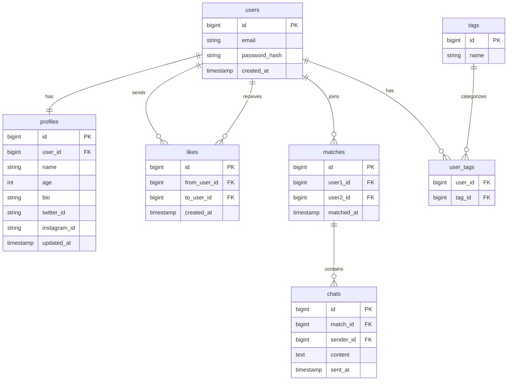

# 友達マッチングアプリ

## 概要

SNSで繋がりたい人同士をマッチングするカジュアルなサービス

## 使用技術

- Frontend: React
- Backend: Java (SpringBoot)
- DB: MySQL
- インフラ: Docker / AWS

## 機能一覧

### 必須機能

- ユーザー登録・ログイン
- プロフィール作成・編集
- いいね・マッチング機能
- メッセージ機能

### 追加機能

- タグ・趣味での絞り込み検索
- 通知機能

## ER図

## ER図

## 画面設計

（後で追加）
